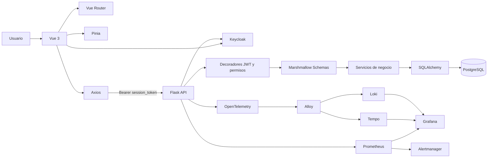
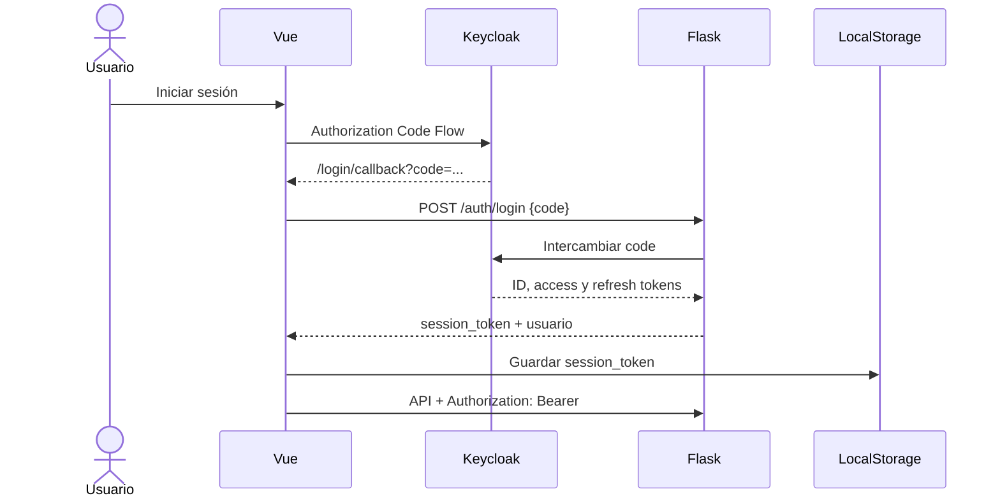
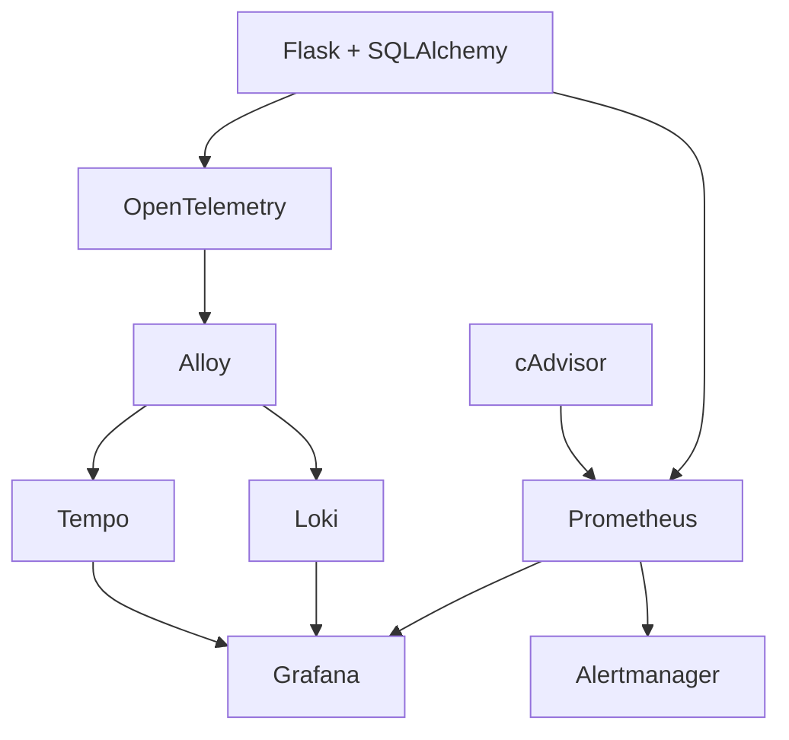
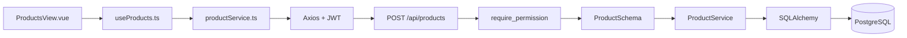
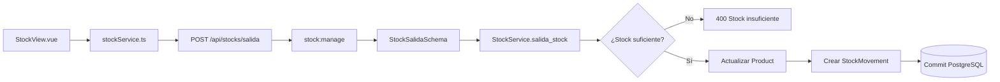
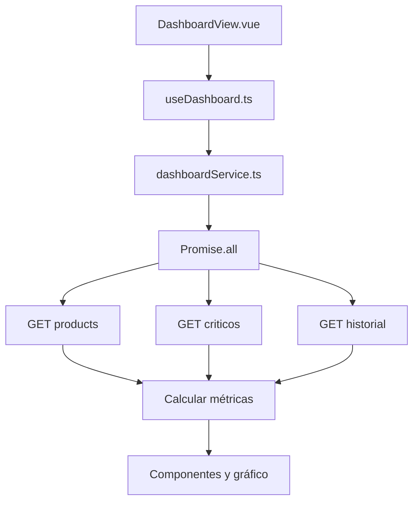

# Game Store

[](https://github.com/StantheManwithoutTan/game_store/actions/workflows/ci.yml)
[](https://github.com/StantheManwithoutTan/game_store/actions/workflows/e2e.yml)
[](https://www.python.org/)
[](https://vuejs.org/)
[](https://docs.docker.com/compose/)
[](https://www.keycloak.org/)
[](https://sonarcloud.io/project/overview?id=StantheManwithoutTan_game_store)

Sistema empresarial de gestión de inventario construido como proyecto final de **Aseguramiento de Calidad de Software**. Integra una aplicación full stack funcional con autenticación y permisos granulares, pruebas en múltiples niveles, análisis de seguridad, rendimiento, observabilidad y automatización CI/CD.

> **Rama de referencia:** [`develop`](https://github.com/StantheManwithoutTan/game_store/tree/develop)  
> **Guía para la defensa:** [`docs/GUIA_PRESENTACION_Y_PRUEBAS.md`](docs/GUIA_PRESENTACION_Y_PRUEBAS.md)

---

## Índice

1. [Qué resuelve](#qué-resuelve)
2. [Estado real del proyecto](#estado-real-del-proyecto)
3. [Arquitectura](#arquitectura)
4. [Tecnologías](#tecnologías)
5. [Funcionalidades](#funcionalidades)
6. [Seguridad y permisos](#seguridad-y-permisos)
7. [Inicio rápido con Docker Compose](#inicio-rápido-con-docker-compose)
8. [Servicios y puertos](#servicios-y-puertos)
9. [Migraciones](#migraciones)
10. [Pruebas](#pruebas)
11. [Seguridad dinámica y dependencias](#seguridad-dinámica-y-dependencias)
12. [Rendimiento con k6](#rendimiento-con-k6)
13. [Observabilidad](#observabilidad)
14. [CI/CD y calidad](#cicd-y-calidad)
15. [Estructura del repositorio](#estructura-del-repositorio)
16. [Flujos técnicos clave](#flujos-técnicos-clave)
17. [Limitaciones conocidas](#limitaciones-conocidas)
18. [Solución de problemas](#solución-de-problemas)
19. [Trabajo colaborativo](#trabajo-colaborativo)

---

## Qué resuelve

Game Store permite administrar productos y existencias mientras mantiene trazabilidad sobre las operaciones realizadas.

El sistema incluye:

- CRUD de productos con SKU, descripción, categoría, precio, cantidad, stock mínimo y estado.
- Entradas, salidas y ajustes de inventario.
- Validación de stock insuficiente.
- Detección de productos críticos.
- Historial de movimientos.
- Auditoría de cambios.
- Dashboard con métricas, productos críticos, movimientos recientes y gráfico.
- Autenticación centralizada con Keycloak.
- Autorización granular mediante permisos incluidos en JWT.
- API REST documentada con OpenAPI y Swagger UI.
- Pruebas unitarias, API, permisos, seguridad, integración, contrato y frontend.
- Pruebas de carga y estrés con k6.
- Métricas, logs y trazas con Prometheus, Loki, Tempo, Alloy y Grafana.
- Pipelines con GitHub Actions y Jenkins.
- Análisis de calidad con SonarCloud.

---

## Estado real del proyecto

| Área | Estado | Evidencia principal |
|---|:---:|---|
| Backend Flask | ✅ | [`backend/app.py`](backend/app.py) |
| Frontend Vue | ✅ | [`game_store_frontend/src`](game_store_frontend/src) |
| PostgreSQL | ✅ | [Docker Compose](.devcontainer/docker-compose.yml) |
| Productos | ✅ | [`ProductService`](backend/services/product_service.py) |
| Stock | ✅ | [`StockService`](backend/services/stock_service.py) |
| Dashboard | ✅ | [`useDashboard.ts`](game_store_frontend/src/composables/useDashboard.ts) |
| Keycloak + JWT | ✅ | [`backend/app.py`](backend/app.py) |
| Permisos granulares | ✅ | [`backend/decorators.py`](backend/decorators.py) |
| OpenAPI / Swagger | ✅ | `http://localhost:5000/api/docs` |
| Pytest | ✅ | [`backend/tests`](backend/tests) |
| Testcontainers | ✅ | Pruebas de integración |
| Schemathesis | ✅ | [`test_contract.py`](backend/tests/test_contract.py) |
| Playwright | ✅ | [`game_store_frontend/tests`](game_store_frontend/tests) |
| OWASP ZAP | ✅ | [Workflow CI](.github/workflows/ci.yml) |
| k6 | ✅ | [`backend/k6`](backend/k6) |
| Observabilidad | ✅ | [Compose](.devcontainer/docker-compose.yml) y [`grafana`](grafana) |
| GitHub Actions | ✅ | [Workflows](.github/workflows) |
| Jenkins | ✅ | [`JenkinsFile`](JenkinsFile) |
| SonarCloud | ✅ | Análisis del repositorio |
| Staging/producción automatizados | 🟡 | Requiere completar y demostrar despliegue |

**Leyenda:** ✅ implementado · 🟡 parcial o pendiente de demostración final.

---

## Arquitectura



### Separación de responsabilidades

| Capa | Ubicación | Responsabilidad |
|---|---|---|
| Vistas | `game_store_frontend/src/views` | Pantallas completas |
| Componentes | `game_store_frontend/src/components` | Presentación reutilizable |
| Composables | `game_store_frontend/src/composables` | Estado reactivo y operaciones de pantalla |
| Servicios frontend | `game_store_frontend/src/services` | Comunicación HTTP |
| Router | `game_store_frontend/src/router` | Navegación y guard de sesión |
| Store | `game_store_frontend/src/stores` | Estado global de autenticación |
| Rutas backend | `backend/routes.py` | Endpoints, permisos y códigos HTTP |
| Schemas | `backend/schemas.py` | Validación y serialización |
| Servicios backend | `backend/services` | Reglas de negocio |
| Modelos | `backend/models.py` | Representación ORM |
| Persistencia | PostgreSQL | Almacenamiento real |

---

## Tecnologías

### Aplicación

| Área | Tecnología |
|---|---|
| Frontend | Vue 3, TypeScript, Vite |
| Estado | Pinia |
| Navegación | Vue Router |
| HTTP | Axios |
| Gráficos | Chart.js / vue-chartjs |
| Backend | Flask |
| API y OpenAPI | Flask-Smorest |
| Validación | Marshmallow |
| ORM | SQLAlchemy |
| Migraciones | Flask-Migrate / Alembic |
| Base de datos | PostgreSQL 17 |
| Identidad | Keycloak |
| Tokens | OAuth2, OpenID Connect y JWT |

### Calidad y operación

| Área | Herramientas |
|---|---|
| Unit/API/Security | Pytest |
| Cobertura | pytest-cov |
| Integración | Testcontainers |
| Contrato | Schemathesis |
| Frontend unitario | Vitest |
| UI funcional | Playwright |
| Dependencias | pip-audit |
| Seguridad dinámica | OWASP ZAP |
| Rendimiento | k6 |
| Calidad | SonarCloud |
| CI | GitHub Actions |
| Pipeline visual | Jenkins |
| Métricas | Prometheus |
| Logs | Loki |
| Trazas | Tempo |
| Collector | Grafana Alloy |
| Dashboards | Grafana |
| Alertas | Alertmanager |
| Infraestructura | Docker Compose, cAdvisor |

---

## Funcionalidades

### Productos

- Crear productos.
- Consultar lista paginada.
- Buscar por nombre.
- Filtrar por categoría y estado.
- Consultar por ID.
- Editar productos.
- Eliminar productos.
- Rechazar SKU duplicado.
- Rechazar precio no positivo.
- Rechazar cantidades negativas.

Código principal:

- [`backend/routes.py`](backend/routes.py)
- [`backend/schemas.py`](backend/schemas.py)
- [`backend/services/product_service.py`](backend/services/product_service.py)
- [`game_store_frontend/src/composables/useProducts.ts`](game_store_frontend/src/composables/useProducts.ts)
- [`game_store_frontend/src/services/productService.ts`](game_store_frontend/src/services/productService.ts)

### Stock

- Registrar entrada.
- Registrar salida.
- Registrar ajuste.
- Rechazar salidas mayores al inventario disponible.
- Guardar cantidad anterior y posterior.
- Guardar usuario, motivo, tipo y fecha.
- Consultar historial.
- Consultar inventario crítico.

Código principal:

- [`backend/services/stock_service.py`](backend/services/stock_service.py)
- [`game_store_frontend/src/services/stockService.ts`](game_store_frontend/src/services/stockService.ts)

### Dashboard

El dashboard combina en paralelo:

```text
GET /api/products
GET /api/stocks/criticos
GET /api/stocks/historial
```

Después calcula:

- Total de productos.
- Productos críticos.
- Unidades disponibles.
- Total de movimientos.
- Diez movimientos más recientes.
- Conteo de entradas, salidas y ajustes para el gráfico.

Código principal:

- [`DashboardView.vue`](game_store_frontend/src/views/DashboardView.vue)
- [`useDashboard.ts`](game_store_frontend/src/composables/useDashboard.ts)
- [`dashboardService.ts`](game_store_frontend/src/services/dashboardService.ts)

---

## Seguridad y permisos

### Flujo de autenticación



### Tres barreras

1. **Vue Router:** comprueba que exista `session_token`.
2. **Axios:** adjunta `Authorization: Bearer <session_token>` y maneja `401`.
3. **Flask:** valida firma, expiración y permisos.

### Matriz de permisos

| Módulo | Permiso | Acción |
|---|---|---|
| Productos | `product:view` | Consultar productos |
| Productos | `product:manage` | Crear, editar y eliminar |
| Stock | `stock:view` | Consultar existencia e historial |
| Stock | `stock:manage` | Registrar entradas, salidas y ajustes |
| Reportes | `report:view` | Consultar reportes |
| Seguridad | `user:manage` | Consultar/gestionar usuarios |
| Auditoría | `audit:view` | Consultar auditoría |

### Respuestas esperadas

| Código | Significado | Comportamiento |
|---:|---|---|
| `200` / `201` | Token válido y permiso correcto | Continúa la operación |
| `401` | Sin token, token inválido o vencido | El frontend elimina la sesión y redirige |
| `403` | Token válido sin el permiso requerido | El usuario sigue autenticado y ve un error |

> **Regla para la defensa:** `401` significa “no puedo validar quién eres”; `403` significa “sé quién eres, pero no puedes ejecutar esta acción”.

---

## Inicio rápido con Docker Compose

### Requisitos

- Git
- Docker Desktop o Docker Engine con Compose v2
- Puertos libres: `3000`, `5000`, `5173`, `8080`, `8081`, `8082`, `9090`, `9093`
- Node.js 20 únicamente para ejecutar el frontend fuera de Docker
- Python 3.12 únicamente para ejecutar el backend fuera de Docker

### 1. Clonar y cambiar a `develop`

```bash
git clone https://github.com/StantheManwithoutTan/game_store.git
cd game_store
git checkout develop
git pull origin develop
```

### 2. Preparar variables de entorno

Crear:

```text
.devcontainer/.env
```

Ejemplo mínimo:

```dotenv
POSTGRES_USER=postgres
POSTGRES_PASSWORD=change-me
POSTGRES_DB=game_store

DATABASE_HOST=db
DATABASE_PORT=5432

SECRET_KEY=change-me-with-a-long-random-secret
FRONTEND_URL=http://localhost:5173

KEYCLOAK_SERVER_URL=http://keycloak:8080
KEYCLOAK_SERVER_URL_EXTERNAL=http://localhost:8080
KEYCLOAK_CLIENT_ID=game-store-client
KEYCLOAK_REALM=game-store
KEYCLOAK_CLIENT_SECRET=
```

No subas `.env` al repositorio.

### 3. Validar la configuración

Desde la raíz:

```bash
docker compose \
  --env-file .devcontainer/.env \
  -f .devcontainer/docker-compose.yml \
  config
```

PowerShell:

```powershell
docker compose --env-file .devcontainer/.env `
  -f .devcontainer/docker-compose.yml `
  config
```

### 4. Construir y levantar el sistema

```bash
docker compose \
  --env-file .devcontainer/.env \
  -f .devcontainer/docker-compose.yml \
  up -d --build
```

PowerShell:

```powershell
docker compose --env-file .devcontainer/.env `
  -f .devcontainer/docker-compose.yml `
  up -d --build
```

### 5. Verificar contenedores

```bash
docker compose \
  --env-file .devcontainer/.env \
  -f .devcontainer/docker-compose.yml \
  ps
```

Ver logs:

```bash
docker compose \
  --env-file .devcontainer/.env \
  -f .devcontainer/docker-compose.yml \
  logs -f backend
```

### 6. Aplicar migraciones

```bash
docker compose \
  --env-file .devcontainer/.env \
  -f .devcontainer/docker-compose.yml \
  exec backend flask db upgrade
```

### 7. Detener el ambiente

```bash
docker compose \
  --env-file .devcontainer/.env \
  -f .devcontainer/docker-compose.yml \
  down
```

Eliminar también volúmenes:

```bash
docker compose \
  --env-file .devcontainer/.env \
  -f .devcontainer/docker-compose.yml \
  down -v --remove-orphans
```

> `down -v` elimina los datos persistidos de PostgreSQL y Jenkins. Úsalo solamente cuando quieras reiniciar el entorno.

---

## Servicios y puertos

| Servicio | URL | Uso |
|---|---|---|
| Frontend | http://localhost:5173 | Aplicación Vue |
| Backend | http://localhost:5000 | API Flask |
| Swagger UI | http://localhost:5000/api/docs | Documentación interactiva |
| OpenAPI JSON | http://localhost:5000/api/openapi.json | Contrato de la API |
| Keycloak | http://localhost:8080 | Identidad y administración |
| Jenkins | http://localhost:8081 | Pipeline visual |
| Grafana | http://localhost:3000 | Dashboards |
| Prometheus | http://localhost:9090 | Métricas |
| Alertmanager | http://localhost:9093 | Alertas |
| cAdvisor | http://localhost:8082 | Métricas de contenedores |
| Loki | http://localhost:3100 | Logs |
| Tempo | http://localhost:3200 | Trazas |
| Alloy | http://localhost:12345 | Collector |

Comprobaciones rápidas:

```powershell
curl.exe -i http://localhost:5000/login
curl.exe -i http://localhost:5000/api/openapi.json
curl.exe -i http://localhost:8080/realms/game-store/.well-known/openid-configuration
curl.exe -i http://localhost:9090/-/ready
curl.exe -i http://localhost:9093/-/ready
```

---

## Migraciones

### Aplicar migraciones existentes

```bash
docker compose --env-file .devcontainer/.env \
  -f .devcontainer/docker-compose.yml \
  exec backend flask db upgrade
```

### Crear una migración después de modificar modelos

```bash
docker compose --env-file .devcontainer/.env \
  -f .devcontainer/docker-compose.yml \
  exec backend flask db migrate -m "describe el cambio"
```

### Revisar el script generado

```text
backend/migrations/versions/
```

### Aplicar el cambio

```bash
docker compose --env-file .devcontainer/.env \
  -f .devcontainer/docker-compose.yml \
  exec backend flask db upgrade
```

### Consultar historial

```bash
docker compose --env-file .devcontainer/.env \
  -f .devcontainer/docker-compose.yml \
  exec backend flask db history
```

> `flask db init` se ejecuta una sola vez para crear el repositorio de migraciones. No debe repetirse en cada instalación si `backend/migrations` ya existe.

---

## Pruebas

### Orden recomendado

1. Validación de Compose.
2. Build.
3. Unitarias.
4. API.
5. Permisos y seguridad.
6. Integración.
7. Contrato.
8. Suite completa y cobertura.
9. Frontend unitario.
10. Build del frontend.
11. Playwright.
12. Dependencias.
13. k6.
14. ZAP.

### Backend: suite completa

```bash
docker compose --env-file .devcontainer/.env \
  -f .devcontainer/docker-compose.yml \
  exec backend pytest -v
```

`backend/pytest.ini` ya define `tests` como directorio de descubrimiento.

### Unitarias

```bash
docker compose --env-file .devcontainer/.env \
  -f .devcontainer/docker-compose.yml \
  exec backend pytest \
  tests/test_product_service.py \
  tests/test_stock_service.py -v
```

### API

```bash
docker compose --env-file .devcontainer/.env \
  -f .devcontainer/docker-compose.yml \
  exec backend pytest tests/test_product_api.py -v
```

### Permisos y seguridad

```bash
docker compose --env-file .devcontainer/.env \
  -f .devcontainer/docker-compose.yml \
  exec backend pytest \
  tests/test_permissions.py \
  tests/test_security.py -v
```

### Integración con PostgreSQL/Testcontainers

```bash
docker compose --env-file .devcontainer/.env \
  -f .devcontainer/docker-compose.yml \
  exec backend pytest \
  tests/test_product_integration.py \
  tests/test_stock_integration.py -v
```

El contenedor `backend` monta `/var/run/docker.sock`; esto permite que Testcontainers cree un PostgreSQL desechable.

### Contrato OpenAPI con Schemathesis

```bash
docker compose --env-file .devcontainer/.env \
  -f .devcontainer/docker-compose.yml \
  exec backend pytest tests/test_contract.py -v
```

La prueba obtiene el contrato desde la aplicación WSGI y genera casos para los endpoints OpenAPI.

### Cobertura

```bash
docker compose --env-file .devcontainer/.env \
  -f .devcontainer/docker-compose.yml \
  exec backend pytest -v \
  --cov=. \
  --cov-report=term-missing \
  --cov-report=html \
  --cov-report=xml
```

Resultados visibles en:

```text
backend/htmlcov/index.html
backend/coverage.xml
```

### Prueba manual de manipulación de JWT

```bash
docker compose --env-file .devcontainer/.env \
  -f .devcontainer/docker-compose.yml \
  exec backend python manual_jwt_security_test.py
```

Debe mostrar:

- Token válido → `200`
- Token manipulado → `401`

### Frontend unitario con Vitest

```bash
cd game_store_frontend
npm ci
npm test
```

### Build del frontend

```bash
npm run build
```

### Playwright

```bash
npx playwright install chromium
npm run test:e2e
```

La configuración de Playwright inicia Vite automáticamente. Las pruebas actuales de productos usan API simulada con `page.route()`: validan navegación, formularios y mensajes de la interfaz, pero no constituyen todavía un recorrido completo hasta PostgreSQL.

---

## Pruebas manuales de API

### 1. Obtener el token

1. Inicia sesión en el frontend.
2. Abre DevTools.
3. Ve a **Application → Local Storage → http://localhost:5173**.
4. Copia `session_token`.

PowerShell:

```powershell
$token = "<session_token>"
```

### 2. Sin token: debe devolver `401`

```powershell
curl.exe -i http://localhost:5000/api/products/
```

### 3. Con `product:view`: debe devolver `200`

```powershell
curl.exe -i http://localhost:5000/api/products/ `
  -H "Authorization: Bearer $token"
```

### 4. Crear producto: `201` con `product:manage`, `403` sin el permiso

```powershell
$body = @{
  name        = "Producto Demo"
  sku         = "DEMO-$([DateTimeOffset]::UtcNow.ToUnixTimeSeconds())"
  description = "Creado durante la demostración"
  category    = "Demo"
  price       = 39.99
  quantity    = 10
  min_stock   = 3
  status      = "active"
} | ConvertTo-Json

Invoke-RestMethod `
  -Uri "http://localhost:5000/api/products/" `
  -Method Post `
  -Headers @{ Authorization = "Bearer $token" } `
  -ContentType "application/json" `
  -Body $body
```

### 5. Registrar entrada

```powershell
$body = @{
  product_id = 1
  amount     = 5
  motive     = "Entrada de demostración"
} | ConvertTo-Json

Invoke-RestMethod `
  -Uri "http://localhost:5000/api/stocks/entrada" `
  -Method Post `
  -Headers @{ Authorization = "Bearer $token" } `
  -ContentType "application/json" `
  -Body $body
```

---

## Seguridad dinámica y dependencias

### pip-audit

Dentro del backend:

```bash
python -m pip install pip-audit
pip-audit -r requirements.txt
```

En Docker:

```bash
docker compose --env-file .devcontainer/.env \
  -f .devcontainer/docker-compose.yml \
  exec backend sh -lc \
  "python -m pip install -q pip-audit && pip-audit -r requirements.txt"
```

### OWASP ZAP

El workflow de CI ejecuta un baseline scan y publica `zap-report.html` como artefacto.

Ejecución local en Linux:

```bash
mkdir -p security

docker run --rm \
  --network host \
  -v "$PWD/security:/zap/wrk:rw" \
  ghcr.io/zaproxy/zaproxy:stable \
  zap-baseline.py \
  -t http://localhost:5000 \
  -r zap-report.html \
  -I
```

En Docker Desktop, usa la red de Compose y el nombre del servicio:

```powershell
New-Item -ItemType Directory -Force security | Out-Null

docker run --rm `
  --network devcontainer_default `
  -v "${PWD}\security:/zap/wrk:rw" `
  ghcr.io/zaproxy/zaproxy:stable `
  zap-baseline.py `
  -t http://backend:5000 `
  -r zap-report.html `
  -I
```

ZAP descubre enlaces desde la URL inicial y puede usar OpenAPI. Para rutas protegidas hay que suministrar autenticación, contexto o un encabezado `Authorization`; ZAP no obtiene automáticamente un token válido.

---

## Rendimiento con k6

El servicio `k6` monta:

```text
backend/k6       → /scripts
backend/results  → /results
```

### Load test

```powershell
docker compose --env-file .devcontainer/.env `
  -f .devcontainer/docker-compose.yml `
  run --rm k6 run /scripts/load-test.js `
  --out json=/results/k6-load.json `
  --summary-trend-stats="avg,min,med,max,p(50),p(90),p(95),p(99)"
```

### Stress test

```powershell
docker compose --env-file .devcontainer/.env `
  -f .devcontainer/docker-compose.yml `
  run --rm k6 run /scripts/stress-test.js `
  --out json=/results/k6-stress.json `
  --summary-trend-stats="avg,min,med,max,p(50),p(90),p(95),p(99)"
```

### Concurrencia de stock

```powershell
docker compose --env-file .devcontainer/.env `
  -f .devcontainer/docker-compose.yml `
  run --rm k6 run /scripts/concurrent-stock-test.js `
  --out json=/results/k6-concurrent.json `
  --summary-trend-stats="avg,min,med,max,p(50),p(90),p(95),p(99)"
```

La evidencia histórica del repositorio se encuentra en [`performance-testing.md`](performance-testing.md).

---

## Observabilidad

### Flujo



### Señales

| Señal | Herramienta | Ejemplos |
|---|---|---|
| Métricas | Prometheus | productos, críticos, movimientos, fallos de login |
| Logs | Loki | endpoint, método, usuario, correlationId |
| Trazas | Tempo | traceId, spanId y consultas SQL |
| Infraestructura | cAdvisor | CPU, memoria y contenedores |
| Visualización | Grafana | aplicación, infraestructura, negocio y seguridad |
| Alertas | Alertmanager | autenticación, disponibilidad y rendimiento |

### Código

- [`backend/metrics.py`](backend/metrics.py)
- [`backend/telemetry.py`](backend/telemetry.py)
- [Configuración de Alloy](.devcontainer/alloy/config.alloy)
- [Prometheus](.devcontainer/prometheus.yml)
- [Alertmanager](.devcontainer/alertmanager)
- [Dashboards](grafana/dashboards)

### Dashboards

#### Aplicación


#### Infraestructura


#### Negocio


#### Seguridad


### Probar Alertmanager

```powershell
$body = '[
  {
    "labels": {
      "alertname": "TestAlert",
      "severity": "critical",
      "job": "flask"
    },
    "annotations": {
      "summary": "Alerta de demostración"
    }
  }
]'

Invoke-RestMethod `
  -Uri "http://localhost:9093/api/v2/alerts" `
  -Method Post `
  -Body $body `
  -ContentType "application/json"
```

---

## CI/CD y calidad

### GitHub Actions

#### [`ci.yml`](.github/workflows/ci.yml)

- Instala Python 3.12.
- Instala dependencias.
- Ejecuta `pip-audit`.
- Ejecuta pruebas unitarias, API e integración.
- Genera cobertura.
- Construye y levanta el backend.
- Ejecuta OWASP ZAP.
- Publica el reporte ZAP.

#### [`e2e.yml`](.github/workflows/e2e.yml)

- Instala Node.js 20.
- Ejecuta `npm ci`.
- Instala Chromium.
- Ejecuta Playwright.

Ambos workflows reaccionan a `push` y `pull_request`, por lo que un push a `develop` dispara los análisis configurados.

### Jenkins

El contenedor está disponible en:

```text
http://localhost:8081
```

Validación de sintaxis:

```bash
curl -X POST -u usuario:token \
  -F "jenkinsfile=<JenkinsFile" \
  "http://localhost:8081/pipeline-model-converter/validate"
```

### SonarCloud

Para analizar `develop`:

1. El proyecto debe estar vinculado al repositorio.
2. El análisis automático o workflow debe estar habilitado para la rama.
3. Realiza un push o ejecuta manualmente el workflow correspondiente.
4. Abre **Project → Branches → develop**.
5. Revisa Quality Gate, issues, duplicación y cobertura.

La cobertura de Python debe producir `backend/coverage.xml` y la del frontend debe conservar su reporte para que SonarCloud pueda importarlos cuando la configuración del proyecto lo indique.

---

## Estructura del repositorio

```text
game_store/
├── .devcontainer/
│   ├── docker-compose.yml
│   ├── prometheus.yml
│   ├── alloy/
│   ├── alertmanager/
│   └── tempo/
├── .github/
│   └── workflows/
│       ├── ci.yml
│       └── e2e.yml
├── backend/
│   ├── app.py
│   ├── config.py
│   ├── decorators.py
│   ├── extensions.py
│   ├── metrics.py
│   ├── models.py
│   ├── routes.py
│   ├── schemas.py
│   ├── telemetry.py
│   ├── services/
│   ├── tests/
│   ├── k6/
│   └── migrations/
├── game_store_frontend/
│   ├── src/
│   │   ├── components/
│   │   ├── composables/
│   │   ├── router/
│   │   ├── services/
│   │   ├── stores/
│   │   ├── types/
│   │   └── views/
│   ├── tests/
│   ├── package.json
│   └── playwright.config.ts
├── grafana/
│   ├── dashboards/
│   └── datasources/
├── keycloak/
│   └── realm-export.json
├── Dockerfile.jenkins
├── JenkinsFile
├── performance-testing.md
└── README.md
```

---

## Flujos técnicos clave

### Creación de producto



Resultado correcto: `201 Created`.

### Salida de stock



### Dashboard



---

## Limitaciones conocidas

Estas limitaciones deben explicarse con honestidad durante la defensa:

1. El guard de Vue Router comprueba existencia del token; la validación real se hace en Flask.
2. Un `403` no debe redirigir al login; representa falta de permisos, no falta de identidad.
3. El dashboard usa `Promise.all()`: si falla una petición, falla la carga completa.
4. Las métricas de productos se calculan sobre la página solicitada, actualmente hasta 100 registros.
5. El gráfico usa los diez movimientos más recientes y cuenta operaciones, no unidades.
6. Playwright usa endpoints simulados en las pruebas actuales de productos.
7. El frontend conserva `session_token` al recargar, pero no reconstruye automáticamente todo el objeto `user`.
8. El backend implementa `/auth/refresh`, pero el store del frontend todavía no lo usa.
9. El endpoint de reportes devuelve actualmente una respuesta básica.
10. El despliegue automático completo a staging y producción debe terminarse y demostrarse.
11. Las credenciales administrativas de desarrollo y el secreto de k6 deben moverse por completo a variables de entorno antes de un ambiente real.

---

## Solución de problemas

### `develop` no existe localmente

```bash
git fetch origin
git checkout -b develop origin/develop
```

### Hay cambios locales y no permite cambiar de rama

Guardar temporalmente:

```bash
git stash push -u -m "trabajo temporal"
git checkout develop
git pull origin develop
git stash pop
```

### Un contenedor no inicia

```bash
docker compose --env-file .devcontainer/.env \
  -f .devcontainer/docker-compose.yml \
  ps

docker compose --env-file .devcontainer/.env \
  -f .devcontainer/docker-compose.yml \
  logs --tail=200 nombre-del-servicio
```

### Keycloak no conecta a PostgreSQL

```bash
docker compose --env-file .devcontainer/.env \
  -f .devcontainer/docker-compose.yml \
  logs db keycloak
```

Comprueba:

- `POSTGRES_USER`
- `POSTGRES_PASSWORD`
- creación de la base `keycloak`
- `KC_DB_URL`
- healthcheck de PostgreSQL

### El backend no ve cambios de dependencias

```bash
docker compose --env-file .devcontainer/.env \
  -f .devcontainer/docker-compose.yml \
  build --no-cache backend

docker compose --env-file .devcontainer/.env \
  -f .devcontainer/docker-compose.yml \
  up -d backend
```

### Testcontainers no puede usar Docker

Comprueba que el backend tenga:

```yaml
- /var/run/docker.sock:/var/run/docker.sock
```

y que Docker Desktop esté ejecutándose.

### Puerto ocupado

PowerShell:

```powershell
Get-NetTCPConnection -LocalPort 5000,5173,8080,8081,3000,9090,9093 `
  -ErrorAction SilentlyContinue
```

---

## Trabajo colaborativo

### Estrategia de ramas sugerida

```text
main
└── develop
    ├── feature/nombre-funcionalidad
    ├── fix/nombre-correccion
    ├── test/nombre-prueba
    └── docs/nombre-documentacion
```

### Commits convencionales

```text
feat: add stock adjustment endpoint
fix: prevent stock from becoming negative
test: add permission coverage for products
docs: improve setup and presentation guide
refactor: separate dashboard data service
chore: update development dependencies
```

### Flujo recomendado

```bash
git checkout develop
git pull origin develop
git checkout -b docs/readme-and-defense-guide

git add README.md docs/GUIA_PRESENTACION_Y_PRUEBAS.md
git commit -m "docs: improve project documentation and defense guide"
git push -u origin docs/readme-and-defense-guide
```

Luego abre un Pull Request hacia `develop`.

---

## Documentación adicional

- [`docs/GUIA_PRESENTACION_Y_PRUEBAS.md`](docs/GUIA_PRESENTACION_Y_PRUEBAS.md)
- [`performance-testing.md`](performance-testing.md)
- Swagger UI: http://localhost:5000/api/docs

Los documentos de arquitectura y requisitos utilizados para preparar esta versión pueden incorporarse posteriormente dentro de `docs/` si el equipo desea conservarlos en el repositorio.

---

## Equipo

Proyecto académico de la asignatura **Aseguramiento de Calidad de Software**.

La evaluación técnica se sustenta en evidencia reproducible: código, comandos, pruebas, reportes, dashboards, pipelines, issues, commits y Pull Requests.
